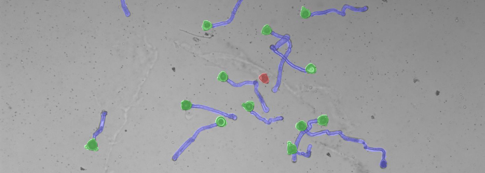

# cucurpollen-utils

This repository provides reference scripts to facilitate the use of the CucurPollen microscopy dataset.

## Overview

The repository includes tools for:

- Converting COCO-format instance annotations into semantic segmentation masks
- Generating a patched dataset for training
- Training and evaluating segmentation models
- Visualizing annotations and model outputs

These scripts are intended as minimal yet practical examples to support reproducibility and simplify further work.

---

## Scripts

### `generate_semantic_masks.py`

Generates semantic segmentation masks from COCO-format annotation files located in: `CucurPollen/annotations`.

For each annotated image, a single-channel mask (`.npy`) is created and saved in: `CucurPollen/masks`.

Pixel values correspond to the following classes:

| Label value | Class name           |
|-------------|----------------------|
| 0           | background           |
| 1           | non_germinated_grain |
| 2           | germinated_grain     |
| 3           | pollen_tube          |

In cases of overlapping annotations, pixel labels are assigned using the following priority: non_germinated_grain > germinated_grain > pollen_tube, ensuring that minority classes overwrite lower-priority labels during mask construction.

This ensures that higher-priority classes overwrite lower-priority labels during mask construction.

---

### `visualize_semantic_masks.py`

Creates overlay visualizations for annotated images.

For each image flagged as `annotated = True` in: `CucurPollen/metadata/master_image.csv`, the script:

1. Loads the original microscopy image
2. Loads the corresponding semantic mask (`.npy`)
3. Generates a color-coded overlay:
   - Red: non_germinated_grain
   - Green: germinated_grain
   - Blue: pollen_tube
4. Saves the overlay image to: `CucurPollen/overlayed/`

This allows rapid qualitative inspection of annotation consistency.

---

### `generate_patched_dataset.py`

Creates a ready-to-use dataset of patches with the selected patch size.

For each image flagged as `annotated = True` in: `CucurPollen/metadata/master_image.csv`, the script:

1. Loads the original microscopy image
2. Loads the corresponding semantic mask (`.npy`)  
3. Resizes the image and the mask to the nearest dimensions divisible by the selected patch size.
4. Divides the resized image and mask into patches of the selected patch size.
5. Saves the generated patch to: `CucurPollen/dataset/`

Test images are not patched so test metrics can be calculated at the full image level.

---

### `train_models.py`

Minimal training example using the patched CucurPollen dataset. A set of baseline models can be selected using the SMP package, including U-Net, U-Net++, Deeplabv3, Deeplabv3+, Segformer, etc.

The script:

1. Creates datasets and dataloaders.
2. Randomly initializes models.
3. Performs training and validation loops.
4. Saves logs and best and last checkpoint to `checkpoints/{model_name}`.
   
A patience criterion based on the validation loss is used to prevent overfitting and save time.

---

### `test_models.py`

Evaluates trained models on the test subset at the full image level.

The script:

1. Loads, preprocesses and patches the test images as in `generate_patched_dataset`.
2. Predicts each patch with the selected trained model.
3. Reconstructs full predicted masks.
4. Calculates test metrics at the full image level.
5. Illustrates predictions and saves the plots to `test/{model_name}`.
6. Saves metrics to `test/test_metrics.xlsx`.

---

### `utils.py`

Contains shared utility functions used across scripts.

---

## Dataset

The complete CucurPollen dataset is publicly available in the Zenodo repository under DOI: **10.5281/zenodo.18736035**

---

## Citation
